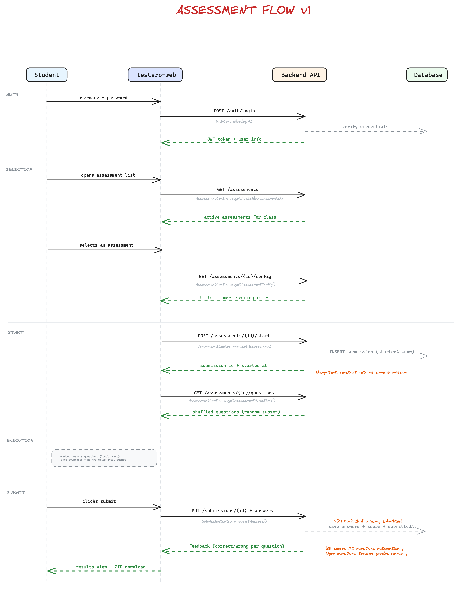
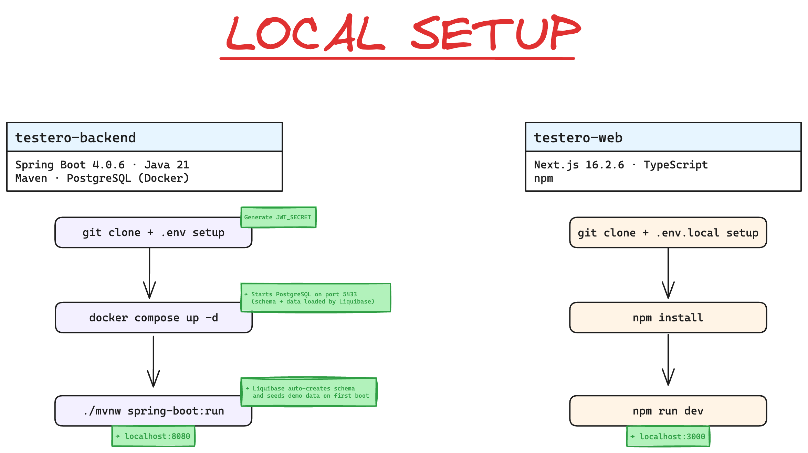

# testero-backend

[](https://github.com/testero-app/testero-backend/releases)

Backend for **Testero**, an open source system for administering tests
and assessments, designed for educational settings: private schools,
training organizations, teachers, and trainers.

This repository contains the **backend API**. The web frontend lives in
[testero-web](https://github.com/testero-app/testero-web).

## Stack

- **Framework**: Spring Boot
- **Language**: Java
- **Database**: PostgreSQL (the hosted project uses [Supabase](https://supabase.com), but any PostgreSQL instance works)
- **Migrations**: [Liquibase](https://www.liquibase.org/) (runs automatically on startup)
- **Hosting**: [Render](https://render.com) via Docker (any container-compatible platform works)
- **Build**: Maven (wrapper included)

## Architecture




## Getting Started



Prerequisites:

- JDK 21 or later
- Docker (for local PostgreSQL)

```bash
# Clone the repository
git clone https://github.com/testero-app/testero-backend.git
cd testero-backend

# Start PostgreSQL
docker compose up -d

# Copy the environment variables template and fill in the values
cp .env.example .env

# Run the application (starts with "dev" profile by default)
./mvnw spring-boot:run
```

To stop PostgreSQL: `docker compose down`.

To **reset the database** (wipe all data and let Liquibase recreate everything on next startup):

```bash
docker compose down -v && docker compose up -d
```

### Environment Variables

| Variable | Description |
|----------|-------------|
| `SPRING_PROFILES_ACTIVE` | `dev` (local) or `prod` (Render) — defaults to `dev` |
| `DATABASE_URL` | PostgreSQL JDBC connection string |
| `JWT_SECRET` | HS256 signing key, min 256 bits — generate with `openssl rand -hex 32` |
| `CORS_ORIGINS` | Allowed frontend origin (e.g. `http://localhost:3000`) |

See [`.env.example`](./.env.example) for the expected format.

### Spring Profiles

| Profile | Purpose | Datasource |
|---------|---------|------------|
| `dev` | Local development | Docker Compose PostgreSQL (hardcoded in profile) |
| `prod` | Production (Render) | `DATABASE_URL` env var (Supabase) |

### Database Migrations

The database schema is managed by **Liquibase**. Migrations run
automatically when the application starts — there is no manual step
required.

Changelog files live under `src/main/resources/db/changelog/` and are
organized by version (e.g. `v1.0/`). The master file
`db.changelog-master.yaml` includes all version directories in order.

**First-time setup:** just start the application against an empty
database. Liquibase will create all tables, indexes, and constraints.

**Adding a migration:** create a new changeset file in the current
version directory (or a new `vX.Y/` directory for a new release), then
add an `include` entry in `db.changelog-master.yaml`.

> **Note (Supabase):** if you connect through the Supabase connection
> pooler (port 6543 / PgBouncer), add `prepareThreshold=0` to the JDBC
> URL to avoid prepared-statement conflicts.

## CI & Code Quality

Run all checks locally (same as CI):

```bash
./mvnw compile checkstyle:check spotbugs:check test
```

The CI pipeline runs four steps on every PR to `main`:

| Step | What it does |
|------|-------------|
| **Compile** | Verifies the code compiles without errors |
| **Checkstyle** | Enforces code style (indentation, imports, naming) |
| **SpotBugs** | Static analysis for common bug patterns |
| **Test** | Runs the full test suite (JUnit 5 + Mockito) |

The "Build & Verify" check is **required** — PRs cannot be merged if any
step fails. Tests also run during the **Docker build on Render**, blocking
deploys if they fail.

Test coverage reports are generated by [JaCoCo](https://www.jacoco.org/)
and available under `target/site/jacoco/` after running `./mvnw test`.

> **For contributors:** every change to backend logic must include tests.
> See [CONTRIBUTING.md](./CONTRIBUTING.md#testing) for details.

## Releases

This project uses [Release Please](https://github.com/googleapis/release-please)
for automated versioning and changelog generation.

Versioning follows [Semantic Versioning](https://semver.org/) and is driven
by [Conventional Commits](https://www.conventionalcommits.org/) prefixes:

| Prefix | Version bump |
|--------|-------------|
| `fix:` | Patch (1.0.0 → 1.0.1) |
| `feat:` | Minor (1.0.0 → 1.1.0) |
| `feat!:` / `BREAKING CHANGE:` | Major (1.0.0 → 2.0.0) |

After each merge to `main`, Release Please opens (or updates) a Release
PR that bumps the version in `pom.xml` and updates `CHANGELOG.md`. When
the Release PR is merged, a git tag and a GitHub Release are created
automatically.

## Contributing

Contributions are welcome. Please read [CONTRIBUTING.md](./CONTRIBUTING.md)
before opening a pull request. All contributions follow the
Developer Certificate of Origin (DCO) model.

## License

Released under the
[GNU Affero General Public License v3.0](./LICENSE).

This means anyone can use, modify, and redistribute the software, as long
as modified versions remain under the same license and the source code is
made available — including when the software is offered as a network service.

## Website

[testero.app](https://testero.app)
